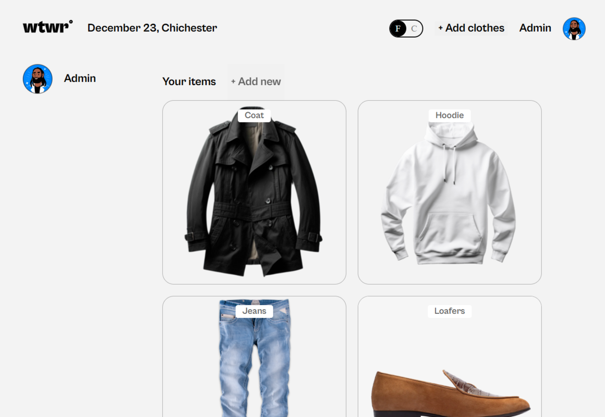

# Project: Project-React (WTWR Frontend)

### Overview

Project-React is the frontend for the full-stack “WTWR — What To Wear?” application. WTWR helps users decide what clothing to wear based on real-time weather data. This version of the app will fetch weather info from a Weather API and automatically recommend suitable clothing items.

This project focuses on building the React-based frontend, applying core concepts such as components, props, state management, hooks, and modular architecture. It also lays the foundation for future backend integration.

### Tools & Technologies

- React
- Vite
- JavaScript (ES6+)
- CSS
- Responsive Design
- OpenWeather API Integration

## Project links

[GitHub Link:](git@github.com:chemai-dev/se_project_react.git)

### WIP

This project is still under development. Future iterations will include API-driven weather data, clothing recommendations, expanded user interactions, and backend connectivity.
